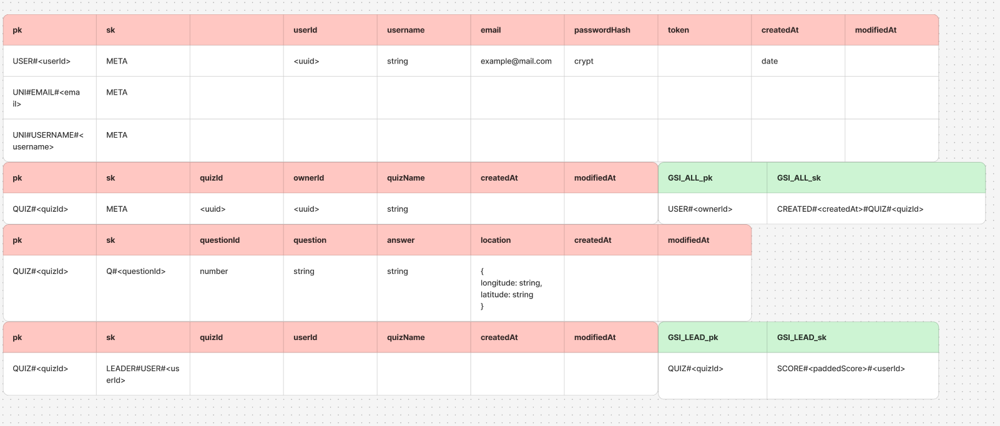

# Quiztopia
### Maria Kjellholm

#### Datamodell:

### Kort info:
- Jag har skrivit i typescript, för att utmana mig själv.
- Det finns data för att logga in användare eller kolla på specifikt quiz i src/assets/dummyData.json

### Kravspecifikation
#### Godkänt:
- ✅  Det går att skapa konto och logga in.
- ✅ Det går att se alla quiz, vad quiz:et heter samt vem som skapat det.
- ✅ Det går att välja ett specifikt quiz och få alla frågor.
- ✅ Kräver inloggning
- ✅ Det går att skapa ett quiz.
- ✅ Det går att lägga till frågor på ett skapat quiz.
- ✅ En fråga innehåller: Frågan, svaret samt koordinater på kartan (longitud och latitud, dessa kan vara påhittade och måste inte vara riktiga koordinater).
- ✅ Det går att ta bort ett quiz.
- ✅ config-fil för Postman med exempelanrop

#### VG-krav
- ✅Leaderboard, två endpoint (lägga till poäng, se top scores för en quiz)
- ✅ Du ska ha en policy i din serverless framework

#### Tekniska krav
✅ Serverless framework
✅ Middy
✅ JSON Web Token (använder jose-paketet)
✅ API Gateway
✅ AWS Lambda
✅ DynamoDB

